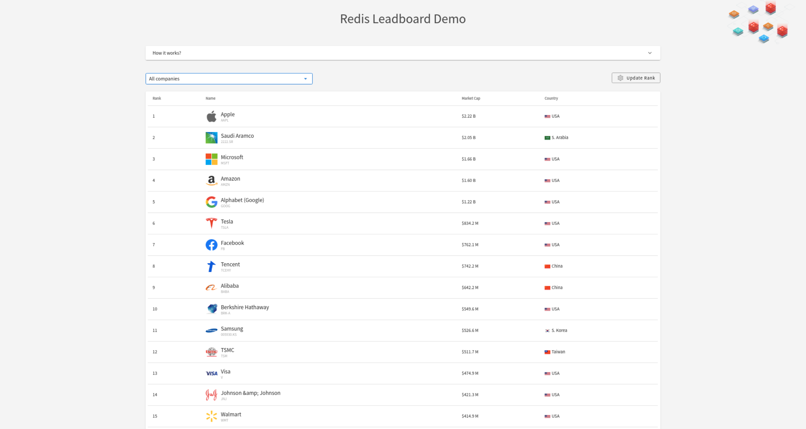
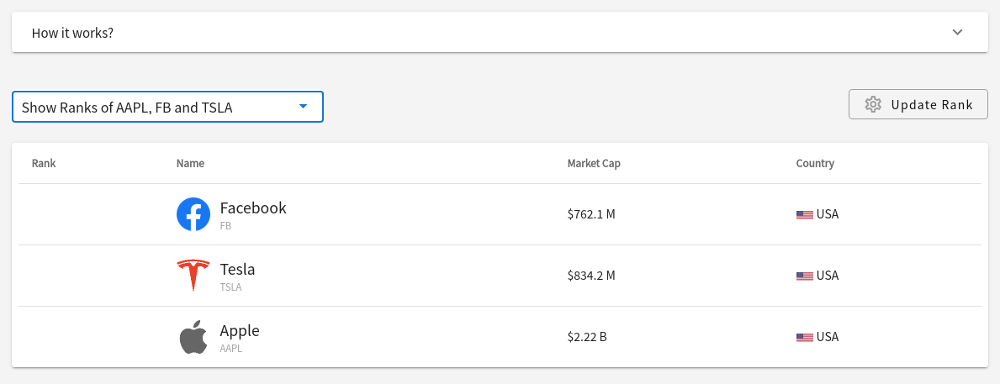
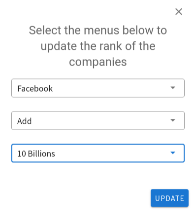

# Basic Redis Leaderboard Demo Ruby on Rails

Show how the redis works with Ruby on Rails.

#### Deploy to Heroku

<p>
  <a href="" target="_blank">
      
  </a>
</p>


## Screenshots


# How it works?
## 1. How the data is stored:
<ol>
  <li>The company data is stored in a hash like below:
    <pre>HSET "company:AAPL" symbol "AAPL" market_cap "2600000000000" country USA</pre>
   </li>
  <li>The Ranks are stored in a ZSET.
    <pre>ZADD companyLeaderboard 2600000000000 company:AAPL</pre>
  </li>
</ol>

<br/>

## 2. How the data is accessed:
<ol>
    <li>
      Top 10 companies: <pre>ZREVRANGE companyLeaderboard 0 9 WITHSCORES</pre>
      
    </li>
    <li>
      All companies: <pre>ZREVRANGE companyLeaderboard 0 -1 WITHSCORES</pre>
      
    </li>
    <li>
      Bottom 10 companies: <pre>ZRANGE companyLeaderboard 0 9 WITHSCORES</pre>
      
    </li>
    <li>
      Between rank 10 and 15: <pre>ZREVRANGE companyLeaderboard 9 14 WITHSCORES</pre>
      
    </li>
    <li>
      Show ranks of AAPL, FB and TSLA: <pre>ZSCORE companyLeaderBoard company:AAPL company:FB company:TSLA</pre>
      
    </li>
    <li>
      Adding market cap to companies: <pre>ZINCRBY companyLeaderBoard 1000000000 "company:FB"</pre>
      
    </li>
    <li>
      Reducing market cap to companies: <pre>ZINCRBY companyLeaderBoard -1000000000 "company:FB"</pre>
      
    </li>
</ol>

## How to run it locally?

### Prerequisites

- Ruby - v2.7.2
- Rails - v5.2.4.5
- NPM - v6.14.8

## Development

```
git clone
```

#### Run frontend

```sh
cd client
npm i
npm run serve
```

#### Run backend

``` sh
cd leaderboard
bundle install
cp config/database.example.yml config/database.yml
rails s
```

#### Run in browser

``` sh
open your browser and put 'http://localhost:8080'
```
